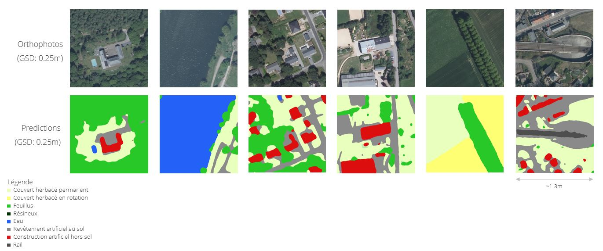

# WalousMàJ

WALOUS - Copyright (C) <2022> <Service Public de Wallonie (SWP)>.

## Contexte
Ce package a été développé par [Aerospacelab](https://www.aerospacelab.be/) pour le Service Public de Wallonie dans le cadre de la mise à jour de la carte d'occupation des sols de 2018. Ce marché s'inscrit dans le cadre du projet [Walous](https://geoportail.wallonie.be/walous)

## Données de sortie
Celui-ci permet donc de générer la carte d'occupation des sols pour le territoire wallon. Ce dernier est segmenté en utilisant les classes de Walous:
- Revêtement artificiel au sol
- Construction artificielle hors sol
- Rail
- Sols nus
- Eau de surface
- Couvert herbacé en rotation
- Couvert herbacé permanent
- Résineux > 3m
- Feuillus > 3m
- Résineux <= 3m
- Feuillus <= 3m

Le format de la donnée de sortie peut être multiple: raster ou vectoriel.

Quelques exemples de prédictions du modèle (à une résolution spatiale de 0.25m/pixel):

## Données d'entrée
Pour ce faire, la solution, découpée en multiple blocs configurables, requiert comme données d'entrée:
- Orthophotos 16-bits 4 bandes (rouge, vert, bleu, infra-rouge), maillées
- Modèle numérique de hauteur
- Modèle numérique de surface

## Pipeline
Le pipeline de la solution est constitué de 13 blocs indépendants et en charge d'une tâche précise. Chacun de ceux-ci peut être adapté aux besoins de l'utilisateur grâce à un fichier de configuration.

Dans l'ordre, le pipeline est constitué des blocs suivants:
1. Initialization

    Cette phase d’initialisation a pour but de vérifier les données fournies en entrée de pipeline et de préparer l’exécution de la solution selon les paramètres fournis. C’est notamment durant cette phase que les différentes bases de données sont réinitialisées, que la configuration de l’exécution est déterminée, et que la distinction entre une nouvelle exécution et la reprise de l’exécution précédente est faite.

2. Preprocessing

    Le bloc Preprocessing applique un pré-traitement aux données d’entrée afin de préparer celles-ci pour le prochain bloc appliquant le modèle d’apprentissage profond. Il s’agit principalement de calculer, pour chaque maille, le MNH et de le concaténer à l’orthophoto.

3. Inference

    Le bloc Inference est probablement le plus important de la solution puisque c’est celui qui génère la nouvelle version de la carte d’occupation des sols pour les classes principales. C’est donc ce bloc qui contient le modèle d’apprentissage profond.

4. Resampling

    Le bloc Resampling se charge du rééchantillonnage des prédictions faites par le modèle à une résolution spatiale de 1m/pixel. Ce bloc a été dissocié du précédent afin de faciliter une éventuelle transition future vers une plus haute résolution.

    Cette étape est optionnelle

5. Erosion

    Ce bloc Erosion permet, une fois la résolution spatiale de la donnée de sortie établie grâce au bloc précédent, d’appliquer un MMU en replaçant la classe assignée aux zones regroupant moins de pixels contigus appartenant à la même classe que le seuil requis, par la classe de la zone voisine la plus grande. Ainsi les petites zones entraînant un bruit sont masquées. Tel est le cas par exemple pour les trouées en forêts, ou encore certains abris de jardin, qui sont homogénéisés avec leur environnement immédiat.

    Cette étape est optionnelle

6. Fusion

    Le bloc Fusion propose de fusionner des données vectorielles avec la donnée raster afin d’en dériver des doubles labels. Ce bloc n’altère pas les prédictions du modèle pour la classe « vue du ciel ». Un étalement de labels en résulte.

    Cette étape est optionnelle.

7. Compulsion

    Ce bloc Compulsion permet de forcer des données vectorielles sur la donnée raster obtenue à la suite de tous les blocs précédents. Ceci remplace donc irrémédiablement les données originales. Ce bloc est utile afin de corriger des zones spécifiques où le modèle se serait trompé dans ses prédictions.

    Cette étape est optionnelle.

8. Comparison

    Le bloc Comparison compare les données prédites par le modèle avec la version précédente de la carte d’occupation des sols. Cette comparaison est faite maille par maille et plusieurs paramètres de configuration y sont associés pour permettre notamment de faire cette comparaison uniquement sur les classes « vues du ciel ».

    Cette étape est optionnelle.

9. Coalescence

    Dans ce bloc Coalescence, les résultats obtenus pour chaque maille (i.e. résultats du bloc Compulsion et, optionnellement, du bloc Comparison) sont agglomérés et fusionnés dans leurs rasters respectifs.

10. Cropping

    Ce bloc Cropping a la charge de rogner le raster sur base d’une zone d’intérêt prédéfinie. Par défaut, le rognage se fait sur le territoire wallon.

    Cette étape est optionnelle.

11. Reprojection

    Le bloc Reprojection permet d’aligner la donnée raster à une grille prédéfinie ainsi que de reprojeter les données dans un nouveau référentiel de coordonnées spatiales. Ainsi si les données d’entrée sont en Lambert Belge 72, il est possible avec ce bloc de reprojeter les données de sortie en Lambert Belge 2008 au lieu de les obtenir en Lambert Belge 72.

    Cette étape est optionnelle.

12. Compression

    Ce bloc de post-traitement a pour but de compresser la/les donnée(s) raster afin d’en réduire la taille du fichier.

    Cette étape est optionnelle.

13. Vectorization

    Le dernier bloc se charge de la vectorisation (sans simplification) du/des raster(s) :
    - WAL_OCS_IA_2019/20
    - WAL_OCS_CHA_IA__2018_2019/20
      

    Cette étape est optionnelle.
